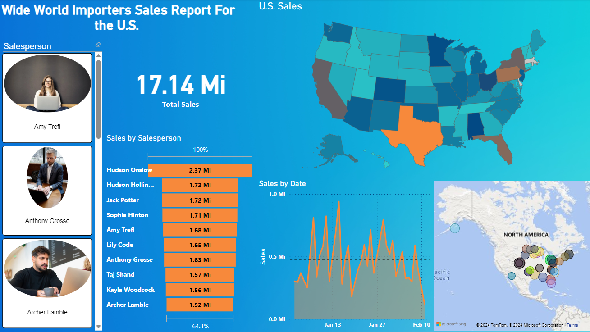
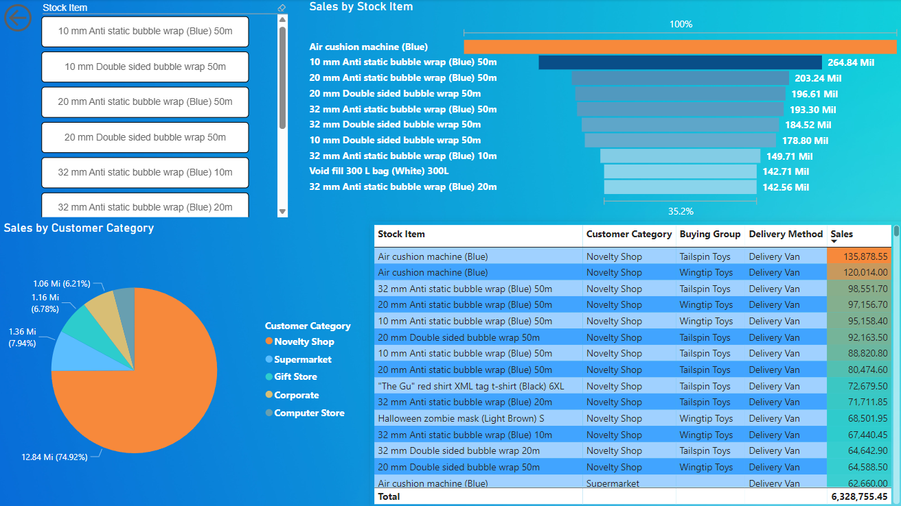

# Wide World Importers U.S. Sales 🗽

## Introduction
This project analyzes sales, salesperson performance and Top 10 items sold across the United Sates based on the Wide World Importers (WWI) database. It should serve as a basis on importing and analyzing data from SQL Server. 
 The WWI database was imported into SQL Server and presented in a Power BI report.

## Tools and Setup
* The WWI database can be dowloaded on the official [Microsoft GitHub page](https://github.com/Microsoft/sql-server-samples/releases/tag/wide-world-importers-v1.0).
* ⚠️This project uses the SQL Server 2016 SP1 (or later) version! See the installation and configuration [instructions](https://learn.microsoft.com/en-us/sql/samples/wide-world-importers-oltp-install-configure?view=sql-server-ver16).
* The report was made using Power BI Desktop.

## 1. Creating a fact table in SQL Server
After importing the WWI database into SQL Server, you will need to create a *Fact table* in order to make the the connection to dimension tables. The fact table will have keys and some useful information like names and measures (total sales).
You can find the SQL code in the [create_fact_table.sql](create_fact_table.sql) file.

## 2. Importing tables into Power BI
Below you will see the tables used in the project. In Power BI, import data through SQL Server, input the server, credentials and select the tables.
* Application.Cities
* Application.Countries
* Application.DeliveryMethods
* Application.People
* Application.StateProvinces
* Purchasing.PurchaseOrders
* Purchasing.Suppliers
* Sales.BuyingGroups
* Sales.CustomerCategories
* Sales.Customers
* Sales.OrderLines
* Sales.Orders
* SalesFact (our created fact table)
* Warehouse.StockItems

## 3. Data cleaning and transformation
Make sure the columns are of the correct data type. For example, you can set TotalSales to fixed decimal number and OrderDate to date.
If you wish, you could delete unnecessary columns, but be careful to not delete essential columns, such as Keys.
* Latitude and Longitude -> To create the map visual, you will have to separate the "Location" column from the Application.Cities table. In Power Query, the data is displayed like (-77.4533235 40.8997903), the first number corresponding to the Longitude and the second to the Latitude.
I first separated the numbers into two columns, with the  parenthesis "( )", for example the longitude would be "(-77.4533235". After that I deleted the parenthesis, now you have two columns of Longitude and Latitude. Also remember to change the data type.

## 4. Creating a Schema
In Model View, delete all the relations (if they were automatically created) and make new ones based on the fact table, as the automatically created relations are probably wrong.
You can see this [image](images/snowflake_schema.png) to have an idea on how the schema should look like.

## 5. Visuals
Here is an example on how to make the report. The overall sales report looks like this: 
❗I used the ChicletSlicer visual to make the salespersons with images. You will have to set URLs for each salesperson and their corresponding name. In this project I used an Excel file to put the names and URLs of free stock images and imported the Excel table into Power BI.  
 Select a salesperson to see only their stats 
 Visualizing only the Top 2 sellers and the sales for the state of Texas 
 Top 10 items sold 
 Items page as Tooltip. Hover over a salesperson and you can see how much they sold of the Top 10 items 

## Conclusion
This project showed how to import the Wide World Importers database into SQL Server, create a facts table and make a Power BI report.
 I hope that this short example could be helpful to your personal project and that it gives you some new ideas on what to perfect or change. Be creative! 🤓  
